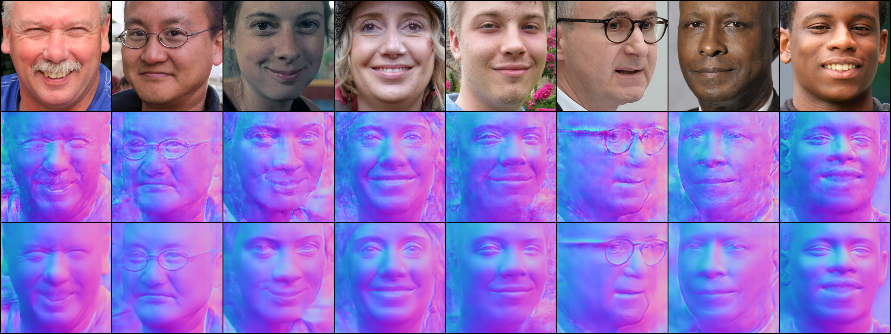

# FNR2R
This repository contains an implementation for the paper "Face Normal Estimation from Rags to Riches".


Although recent approaches to face normal estimation have achieved promising results, their effectiveness heavily depends on large-scale paired data for training. This paper concentrates on relieving this requirement via developing a coarse-to-fine normal estimator. Concretely, our method first trains a neat model from a small dataset to produce coarse face normals that perform as guidance (called exemplars) for the following refinement. A self-attention mechanism is employed to capture long-range dependencies, thus remedying severe local artifacts left in estimated coarse facial normals. Then, a refinement network is customized for the sake of mapping input face images together with corresponding exemplars to fine-grained high-quality facial normals. Such a logical function split can significantly cut the requirement of massive paired data and computational resource. 


<center></center>
From top to bottom are the input face, exemplar and refinement normal.


## Usage
### Coarse prediction network training
#### Training data: 
* [Photoface data](https://uwe-repository.worktribe.com/output/972508)


### Refined network training
#### Training data: 
* [300W](https://ibug.doc.ic.ac.uk/resources/300-W/)
* [FFHQ](https://drive.google.com/drive/folders/1u2xu7bSrWxrbUxk-dT-UvEJq8IjdmNTP) 
* [CelebAMask-HQ](https://github.com/switchablenorms/CelebAMask-HQ)


For normal refinement network training run:
```
python main_s2_train.py 
```

### Testing
#### Download checkpoints: 
* [cpkts](https://drive.google.com/drive/folders/1zY8eidtbzb49rYbOR85vdQvvCkY2Bng6?usp=sharing)

For testing run:
```
python  main_s2_test.py 
```
